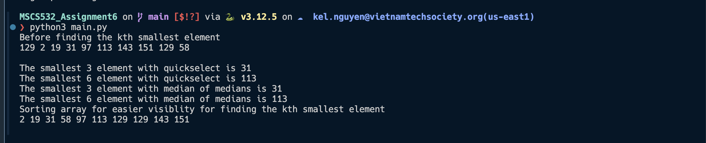

# MSCS532_Assignment6

## Setup
- **Step 1:** Download python https://www.python.org/downloads/
- **Step 2:** Download python extension from vsc https://code.visualstudio.com/

## Output
### Profiler
To run the profiler for the algorithm, we need to execute the the following commands:

- **CPU Profiler:**
```
python3 -m cProfile main.py
```


### Algorithm
- Randomized quickselect will perform the same time complexity O(n) all the time when compared with median
of medians (O(n)). However, in worst case randomized quick select can be O(n^2)

